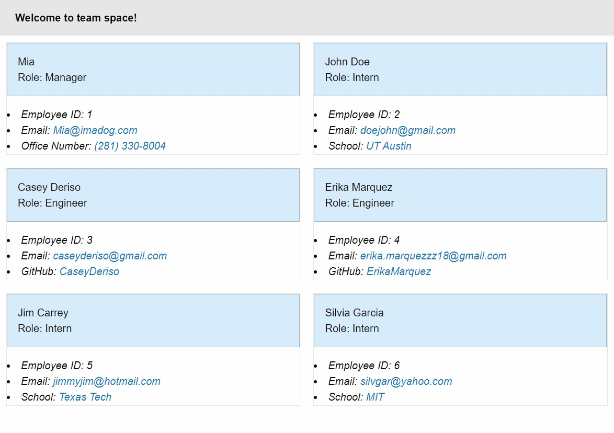

# Team-Space

    

## Description

Team Space is an interactive home page for web development teams. This project is a command line interface application that will take input about your team members and generate a styled home page with cards showing information about each of your team members. Each card will have contact information as well as specific information based on the job title of the individual. 

## Table of Contents:
* [installation](#installation)
* [usage](#usage)
* [screenshot](#screenshot)

## Installation 

This project requires node.js to be installed on your local macine. Once the project is downloaded on your machine, type 'npm install' into the command line to download the required dependencies. Next, type 'node .' to run the application and fill out each of your team members information. The generated page will be saved in the dist/ directory.

## Usage 

The home page that Team Space generates will allow you to easily identify job roles of your team memebers as well as methods of contacting that team member. 

## Screenshot

      

## License 

MIT
